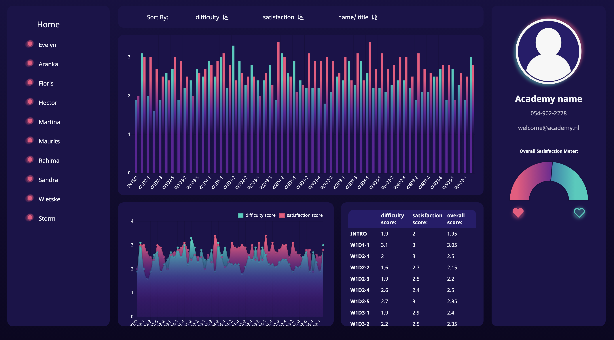

# Student_Dashboard
---

## Description 
A dashboard that displays student satisfaction numbers. 

## Languages, Libraries & Frameworks
* React
* Redux
* JavaScript 
* CSS
* HTML
* Chart.js

## Setup 
1. Clone the repository to a local directory
2. cd into the directory and run `npm start` to run the app in development mode
3. run `npm run build` or `yarn build` to build the app for production

## Screenshots

## Live Demo 
https://eloquent-darwin-440c3c.netlify.app

## Usage & Details 
This dashboard shows (fictional) student's overall satisfaction ratings for each assignment they received from a (fictional) Academy. 

* To view the satisfaction score of a specific student, tap on the desired student's name in the left menu
* To include or exclude specific student scores from the graph, tap on the pink dot next to the desired student name(s) 
* To view the satisfaction score of a specific assignment, tap on the desired assignment's title in the bottom right table
* To sort the charts by score or name/ title, tap on the desired word in the top menu 
If you tap the desired word again your the charts will get sorted in the reverse order
* To filter out the satisfaction or difficulty scores from a chart, tap on the the desired name in the chart legend 